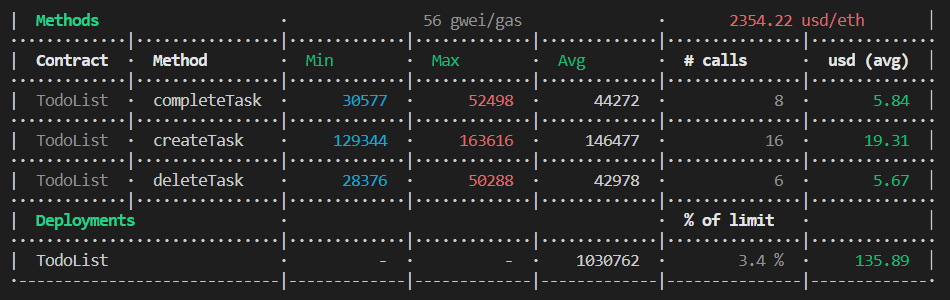

## ilink Academy. Домашняя работа #1. 

### Задача:  
Среда разработки:
https://hardhat.org/

Шаблон:
https://github.com/i-link-pro-team/hardhat-boilerplate

Гид по стилю:
https://docs.soliditylang.org/en/v0.8.13/style-guide.html#style-guide

Общие паттерны:
https://docs.soliditylang.org/en/v0.8.13/common-patterns.html

Вопросы безопасности:
https://docs.soliditylang.org/en/v0.8.13/security-considerations.html#security-considerations

ДЗ:
Скачать наш шаблон с github. Добавить свой контракт TODO.sol
1. Сгенерировать mnemonic, добавить свою фразу в конфиг и использовать на протяжение всей Академии.
2. Используя Гид по стилю, Общие паттерны, Вопросы безопасности исправить свой контракт.
3. Написать deploy.
4. Написать тесты для своего контракта
5. Добавить задачи для cli hardhat своего контракта(tasks):  создать таску, закрыть тастку и так далее

### Реализация
Hardhat 2.9.1;
Solidity 0.8.9;

### Решение

#### Контракт:  
Смарт контракт состоит из: 
1. Структура Task, которая описывает задачу
- string content - Текст задачи
- uint timeBegin - Время создания задачи, в секундах, начиная с 1 января 1970 года (эпоха unix)
- uint timeEnd - Время завершения задачи, в секундах, начиная с 1 января 1970 года (эпоха unix). (Либо 0, если задача ещё не выполнена)
- uint timeRun - время на выполнение задачи, в секундах.    
- bool isDeleted - флаг, показывающий удалена задача или нет.

2. Массив Task[] tasks, который хранит все задачи пользователей
3. Соответствие mapping (uint => address) taskToOwner; //соответствие (id задачи => адрес владельца)
4. Соответствие mapping (address => uint) public ownerTaskCount; // соответствие (адрес владельца => количество задач) 

Реализованные методы:
1. Создать задачу:  
`function createTask(string memory _name, uint _timeRun) public`  
_name - текст задачи, _timeRun - время на выполнение задачи.  

2. Удалить/восстановить задачу (запускаем с правами владельца):  
`function deleteTask(uint _taskId) public onlyOwnerOf(_taskId)`  
_taskId - Идентификатор задачи (её порядковый номер в массиве).  

3. Изменить статус задачи (запускаем с правами владельца):  
`function completeTask(uint _taskId) public onlyOwnerOf(_taskId)`  
_taskId - Идентификатор задачи (её порядковый номер в массиве).  

4. Получить конкретную задачу:  
`function getOne(uint _taskId) external view returns(Task memory)`  
_taskId - Идентификатор задачи (её порядковый номер в массиве).  

5. Получить все задачи:  
`function getAll() external view returns(Task[] memory)`  

6. Получить все задачи конкретного пользователя:  
`function getAllByOwner(address _owner) external view returns (uint[] memory)`  
_owner - Адрес пользователя.  

7. Получить процент выполненных в срок задач по пользователю:  
`function getPercent(address _owner) external view returns(uint)`  
_owner - Адрес пользователя.  

#### Задачи для cli hardhat
Смарт контракт размещался в тестовой сети Rospen.
1. Создать задачу:  
`npx hardhat create-task --network ropsten --address $address --content $content" --time $time`  
$address - адрес контракта, $content - текст новой задачи, $time - время на выполнение новой задачи. 

2. Удалить/восстановить задачу:  
`npx hardhat delete-task --network ropsten --address $address --id $id`  
$address - адрес контракта, $id - идентификатор задачи (её порядковый номер в массиве).  

3. Изменить статус задачи (запускаем с правами владельца):  
`npx hardhat complete-task --network ropsten --address $address --id $id`  
$address - адрес контракта, $id - идентификатор задачи (её порядковый номер в массиве).  

4. Получить конкретную задачу:  
`npx hardhat get-one-task --network ropsten --address $address --id $id`  
$address - адрес контракта, $id - идентификатор задачи (её порядковый номер в массиве).  

5. Получить все задачи:  
`npx hardhat get-all-tasks --network ropsten --address $address`  
$address - адрес контракта.  

6. Получить все задачи конкретного пользователя:  
`npx hardhat get-user-tasks --network ropsten --address $address --user $addressUser`  
$address - адрес контракта, $addressUser - адрес пользователя.  

7. Получить процент выполненных в срок задач по пользователю:  
`npx hardhat get-percent --network ropsten --address $address --user $addressUser`  
$address - адрес контракта, $addressUser - адрес пользователя.  

#### Тестирование
Автоматизированные тесты описаны в файле tests\TodoList.test.ts и запускаются командой:  
`npx hardhat test tests\TodoList.test.ts`

Анализ расхода газа можно включить с помощью ключа GAS_REPORT:

#### Проверка и публикация исходного кода контракта
Команда для публикации контракта в тестовой сети ropsten:  
`npx hardhat deploy --network ropsten --tags TodoList`

Команда для верификации контракта в сети ropsten:  
`npx hardhat --network ropsten etherscan-verify --solc-input --contract-name TodoList
`

Адрес смарт контракта: `0xA972C5E2c0Dd179b2474B44d523EC9163685bde2`

